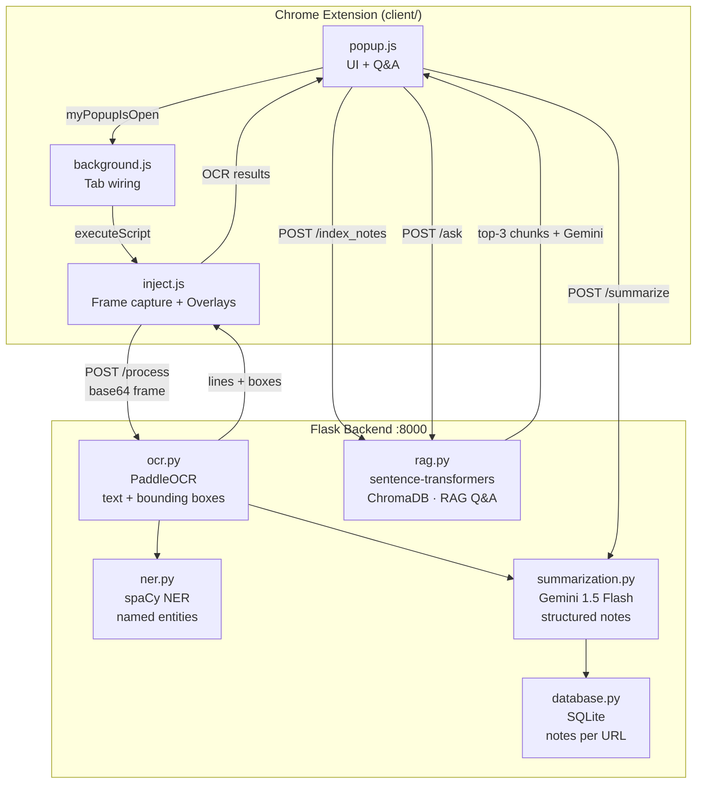
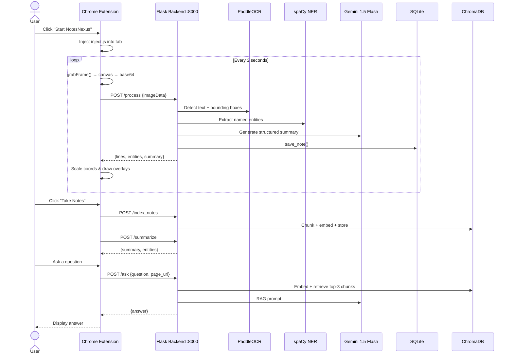
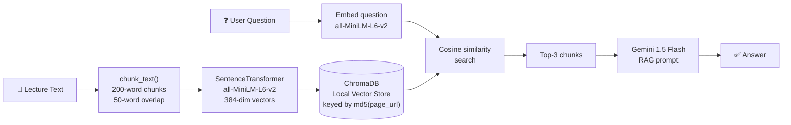

<div align="center">

<h1>📝 NotesNexus</h1>

<p><strong>AI-powered lecture note-taking, directly on top of any video.</strong></p>

<p>
  
  
  
  
  
</p>

<p><em>Select text on any YouTube, Google Meet, or Discord video — just like a normal webpage.</em></p>

</div>

---

## 🤔 The Problem

Watching lecture videos means constantly **pausing → reading → retyping** slide text into notes. Fast-moving slides make it worse. There's no native way to copy text from a video.

## ✅ The Solution

NotesNexus runs **OCR on live video frames** every 3 seconds and places **invisible, selectable HTML overlays** pixel-perfectly on top of detected text — so you can highlight, copy, and save lecture content like any webpage. It then uses **Gemini + RAG** to summarize content and answer your questions about it.

---

## ✨ Features

| Feature | Description |
|---|---|
| 🖱️ **Text Selection on Video** | PaddleOCR detects text; transparent HTML divs make it selectable |
| 🔑 **Key Topic Extraction** | spaCy NER identifies named entities (people, places, concepts) |
| 🤖 **AI Summaries** | Gemini 1.5 Flash produces structured lecture notes |
| 💬 **RAG Q&A** | Ask questions about captured content; ChromaDB retrieves relevant chunks |
| 💾 **Persistent Notes** | SQLite stores notes per URL; reload and resume any session |
| 🔄 **Live Tracking** | Overlays automatically update when slide content changes |

---

## 🏗️ Architecture



---

## 🔄 End-to-End Data Flow



---

## 📂 Project Structure

```
NotesNexus/
├── client/                         # ✅ Primary Chrome Extension (load this)
│   ├── manifest.json               # MV2 manifest — permissions, background, popup
│   ├── inject.js                   # Core: frame capture + OCR overlay engine
│   ├── background.js               # Tab injection on popup signal
│   └── src/
│       └── browser_action/
│           ├── popup.js            # UI logic: capture, notes, Q&A
│           └── browser_action.html # Extension popup UI
│
├── backend/                        # Flask API server
│   ├── app.py                      # Route definitions + CORS
│   ├── ocr.py                      # PaddleOCR wrapper → GCP-compatible format
│   ├── summarization.py            # Gemini 1.5 Flash summarization
│   ├── ner.py                      # spaCy named entity recognition
│   ├── rag.py                      # Chunking + ChromaDB + RAG Q&A
│   ├── database.py                 # SQLite notes persistence
│   └── .env.example                # GEMINI_API_KEY template
│
├── client2.0/                      # Experimental fork (not primary)
├── test/                           # Manual test page
├── requirements.txt
└── README.md
```

---

## 🔌 API Reference

### `POST /process`
Main OCR pipeline. Accepts a video frame, returns text, entities, and summary.

```json
// Request
{ "imageData": "<base64 PNG>", "page_url": "https://youtube.com/watch?v=..." }

// Response
{
  "full_text": "line1 . line2 . line3",
  "lines": [{ "text": "Hello World", "bounding_box": { "x": 10, "y": 20, "width": 200, "height": 24 } }],
  "entities": [{ "entity": "Einstein", "label": "PERSON" }],
  "summary": "**Key Concepts:**\n- ..."
}
```

### `POST /index_notes`
Chunks accumulated text and indexes embeddings into ChromaDB for RAG.

```json
// Request
{ "text": "full lecture text", "page_url": "https://..." }
// Response
{ "chunks_indexed": 12 }
```

### `POST /ask`
Retrieves the 3 most relevant chunks and uses Gemini to answer.

```json
// Request
{ "question": "What is gradient descent?", "page_url": "https://..." }
// Response
{ "answer": "Gradient descent is..." }
```

### `POST /summarize` · `GET /notes?page_url=...`
Summarize accumulated text and retrieve past notes for a URL.

---

## 🧠 RAG Pipeline



**Why RAG instead of sending full text?**  
Long lectures exceed LLM context limits and dilute focus. Retrieval sends only the 3 most relevant passages, reducing latency, cost, and hallucination risk.

---

## 🛠️ Tech Stack

| Layer | Technology | Role |
|---|---|---|
| **Extension** | Chrome MV2, Vanilla JS | Frame capture, overlay rendering, popup UI |
| **OCR** | PaddleOCR + Pillow + NumPy | Text detection with bounding boxes |
| **NER** | spaCy `en_core_web_sm` | Named entity extraction |
| **LLM** | Gemini 1.5 Flash | Summaries and RAG answers |
| **Embeddings** | `all-MiniLM-L6-v2` (384-dim) | Semantic chunk search |
| **Vector Store** | ChromaDB | Local persistent similarity search |
| **Database** | SQLite | Notes storage per page URL |
| **Backend** | Flask + flask-cors | REST API server |

---

## ⚡ Quick Start

### 1. Backend

```powershell
# Clone and set up Python environment
cd NotesNexus
python -m venv env
.\env\Scripts\Activate.ps1          # Windows
# source env/bin/activate           # macOS/Linux

pip install -r requirements.txt
pip install "numpy>=1.24,<2"        # PaddleOCR compatibility
python -m spacy download en_core_web_sm
```

```bash
# Set your Gemini API key (get one free at aistudio.google.com)
cp backend/.env.example backend/.env
# Edit backend/.env → GEMINI_API_KEY=your_key_here

# Start the server
cd backend
python app.py
# Running on http://localhost:8000
```

### 2. Chrome Extension

1. Open `chrome://extensions`
2. Enable **Developer mode** (top right)
3. Click **Load unpacked**
4. Select the `client/` folder

### 3. Use It

1. Open any YouTube lecture video
2. Click the **NotesNexus** icon in your toolbar
3. Click **Start NotesNexus** — overlays appear on video text within 3 seconds
4. Highlight and copy text directly from the video
5. Click **Take Notes** to save a structured summary
6. Type a question and click **Ask** to query your captured notes

---

## 🔑 Environment Variables

| Variable | Where to get it | Required for |
|---|---|---|
| `GEMINI_API_KEY` | [Google AI Studio](https://aistudio.google.com) | Summaries, RAG Q&A |

---

## 🌐 Supported Platforms

NotesNexus works on **any site that renders video in an HTML5 `<video>` element**. The extension simply runs `document.querySelector("video")` — if the platform uses a standard `<video>` tag (which supports `captureStream()` and `ImageCapture`), it works automatically.

| Platform | Type | Notes |
|---|---|---|
| ✅ YouTube | Lectures / tutorials | Full support |
| ✅ Google Meet | Live classes / meetings | Full support |
| ✅ Microsoft Teams | Live classes / meetings | Browser version |
| ✅ Zoom | Webinars / lectures | Browser version |
| ✅ Discord | Video calls / streams | Full support |
| ✅ Coursera | Online courses | Full support |
| ✅ Udemy | Online courses | Full support |
| ✅ edX | Online courses | Full support |
| ✅ Loom | Recorded walkthroughs | Full support |
| ✅ Vimeo | Hosted videos | Full support |

> **Note:** Native desktop apps (Teams desktop, Zoom desktop) are not supported since the Chrome extension can only inject into browser tabs. Use the browser version of those platforms instead.

---

## 🔍 How Text Overlay Works (Deep Dive)

```
Video frame (native resolution, e.g. 1920×1080)
         │
         │  PaddleOCR returns bounding boxes in native pixels
         ▼
  { x: 960, y: 540, width: 400, height: 30 }
         │
         │  Scale to displayed video size (e.g. 800×450 on screen)
         │  wScale = 800 / 1920 = 0.417
         │  hScale = 450 / 1080 = 0.417
         ▼
  Overlay div positioned at:
  left: 960 × 0.417 = 400px
  top:  540 × 0.417 = 225px
  width: 400 × 0.417 = 167px
         │
         ▼
  <div style="
    position: absolute;
    color: transparent;       ← invisible text, visible to selection
    user-select: text;        ← makes it selectable
    font-size: [bbox height]px;
    z-index: 9999;
  ">detected text here</div>
```

Overlays refresh every 3 seconds. The `isDifferent()` check prevents unnecessary redraws when slides haven't changed.

---

## 📁 `client2.0/` — Experimental Fork

An incomplete experimental fork named "Injecta". Missing deduplication logic and popup wiring. **Use `client/` for all development.**

---

<div align="center">
  <p>Built with 🧠 OCR + LLMs + a love for not retyping lecture slides</p>
</div>